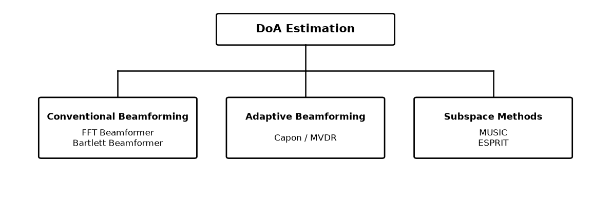

# FMCW Radar DoA Estimation

Direction-of-arrival estimation for automotive FMCW MIMO radar, covering the signal model, snapshot extraction, covariance-matrix processing, and the main DoA algorithms: Spatial FFT, Bartlett, Capon/MVDR, MUSIC, and ESPRIT.

The methods are organized into three groups: conventional beamforming with the Spatial FFT and Bartlett beamformer, adaptive beamforming with Capon/MVDR, and subspace-based estimation with MUSIC and ESPRIT.



The Jupyter notebooks introduce the FMCW MIMO signal model, snapshot extraction strategies, covariance-matrix estimation and preprocessing, and the assumptions behind each DoA algorithm. Key formulas are complemented by compact Python implementations, numerical examples, and practical engineering observations.

The theoretical foundations and algorithm implementations are validated using real measurements acquired with a Texas Instruments **AWR2243** radar. The radar is configured as a two-transmitter, four-receiver TDM MIMO system, forming an eight-element virtual uniform linear array.

<p align="center">
  
</p>

The validation datasets were collected in two measurement campaigns:

### 1. DoA estimation with two static corner reflectors

The first campaign evaluates angular resolution in controlled broadside and off-boresight scenarios using two static corner reflectors. The corresponding workshop and dataset are available [here](...).

<p align="center">
  
  &nbsp;&nbsp;
  
</p>

### 2. DoA estimation in a dynamic street scene

The second campaign evaluates DoA estimation in a dynamic automotive street scene using TDM MIMO measurements. The corresponding workshop and dataset are available [here](...).


## Contents

See the project homepage [here](https://www.fpga-radar.com/fmcw-radar-doa) for examples, too.

The below chapters are rendered via the nbviewer at nbviewer.jupyter.org/, and is read-only and rendered in real-time. Interactive notebooks + examples can be downloaded by cloning!

1. **Signal Model** ·
   [Read chapter](https://farbius.github.io/fmcw-radar-doa/01_signal_model.html) ·
   [View notebook](https://github.com/farbius/fmcw-radar-doa/blob/main/notebooks/01_signal_model.ipynb)

   The narrowband array signal model used for direction-of-arrival (DoA) estimation in FMCW radar

2. **Covariance Matrix** ·
   [Read chapter](https://farbius.github.io/fmcw-radar-doa/02_covariance_matrix.html) ·
   [View notebook](https://github.com/farbius/fmcw-radar-doa/blob/main/notebooks/02_covariance_matrix.ipynb)

   Spatial covariance estimation, matrix interpretation, forward-backward averaging, diagonal loading, eigendecomposition, and source-number estimation for covariance-based DoA processing

3. **FMCW MIMO** ·
   [Read chapter](https://farbius.github.io/fmcw-radar-doa/03_fmcw_mimo.html) ·
   [View notebook](https://github.com/farbius/fmcw-radar-doa/blob/main/notebooks/03_fmcw_mimo.ipynb)

   FMCW TDM-MIMO processing for DoA estimation, with emphasis on the processing chain, covariance snapshot extraction, and comparison of snapshot-formation strategies.

4. **Spatial FFT Beamformer** ·
   [Read chapter](https://farbius.github.io/fmcw-radar-doa/04_fft_beamformer.html) ·
   [View notebook](https://github.com/farbius/fmcw-radar-doa/blob/main/notebooks/04_fft_beamformer.ipynb)

   FFT beamformer fundamentals and performance analysis, including angular resolution and spectral leakage.

5. **Bartlett Beamformer** ·
   [Read chapter](https://farbius.github.io/fmcw-radar-doa/05_bartlett.html) ·
   [View notebook](https://github.com/farbius/fmcw-radar-doa/blob/main/notebooks/05_bartlett.ipynb)

   Bartlett beamformer fundamentals and performance analysis, including angular resolution and steering grid sampling.

6. **Capon MVDR Beamformer** ·
   [Read chapter](https://farbius.github.io/fmcw-radar-doa/06_capon_mvdr.html) ·
   [View notebook](https://github.com/farbius/fmcw-radar-doa/blob/main/notebooks/06_capon_mvdr.ipynb)

7. **MUSIC** ·
   [Read chapter](https://farbius.github.io/fmcw-radar-doa/07_music.html) ·
   [View notebook](https://github.com/farbius/fmcw-radar-doa/blob/main/notebooks/07_music.ipynb)

8. **ESPRIT** ·
   [Read chapter](https://farbius.github.io/fmcw-radar-doa/08_esprit.html) ·
   [View notebook](https://github.com/farbius/fmcw-radar-doa/blob/main/notebooks/08_esprit.ipynb)


### References

1. Van Trees, H. L., *Optimum Array Processing: Part IV of Detection, Estimation, and Modulation Theory*. New York: John Wiley & Sons, 2002.
2. Wirth, W.-D., *Radar Techniques Using Array Antennas*, 2nd ed. London: Institution of Engineering and Technology, 2013.  
3. Bergin, J. S., and Guerci, J. R., *MIMO Radar: Theory and Application*. Boston, MA: Artech House, 2018.


### helpers

```sh
jupyter nbconvert --to html --template classic .\notebooks\xx_sample_page.ipynb --output-dir .\docs
```